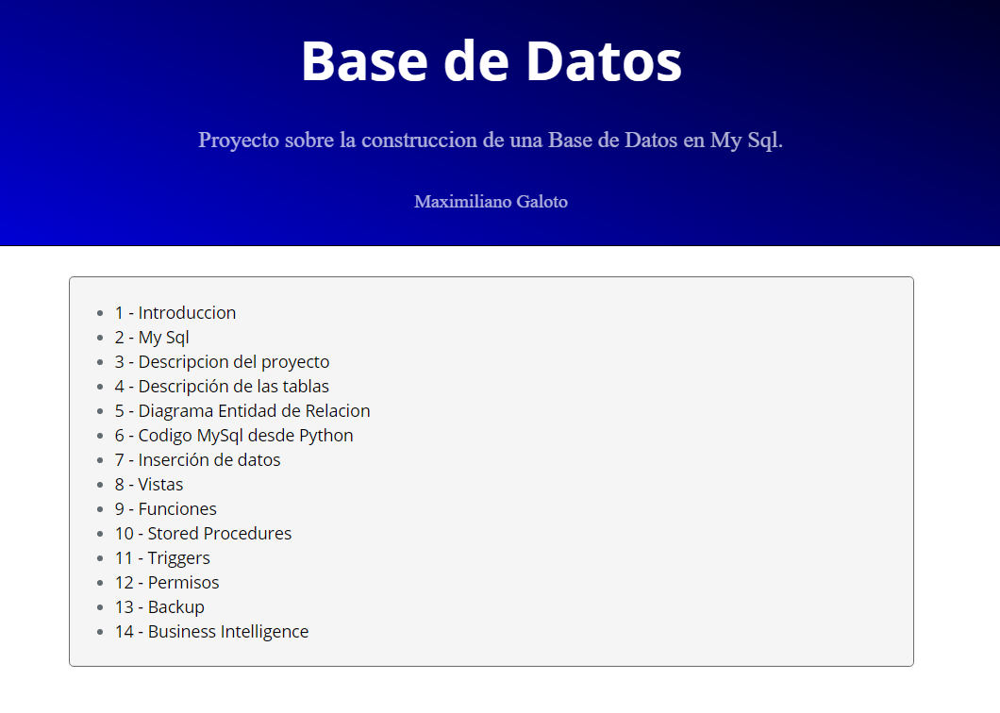

# mysql_creando_database
Creando una Base de datos en MySql desde Python.

# Base de Datos

Proyecto base de datos de una empresa de medicina prepaga.

Se utilizara My Sql para la creacion de la base de datos.

<ui>
<li>
1 - Introduccion
</li>
</li>
2 - My Sql
</li>
<li>
3 - Descripcion del proyecto
</li>
<li>
4 - Descripción de las tablas
</li>
<li>
5 - Diagrama Entidad de Relacion
</li>
<li>
6 - Inserción de datos
</li>
<li>
7 - Incersion de Datos desde Python
</li>
<li>
8 - Inner Join
</li>
<li>
9 - Vistas
</li>
<li>
10 - Funciones
</li>
<li>
11 - Stored Procedures
</li>
<li>
12 - Triggers
</li>
<li>
13 - Permisos
</li>
<li>
14 - Backup
</li>
<li>
15 - Business Intelligence
</li>
<li>
16 - Codigo My Sql desde Python
</li>

</ui>

https://maxi-galo.netlify.app/

# Contenido del Repositorio

<ui>
<li>
Codigo .sql
</li>
<li>
Codigo Python
</li>
<ui>

# Link del Proyecto

[Rpubs](https://rpubs.com/MGaloto/mysql_database)

