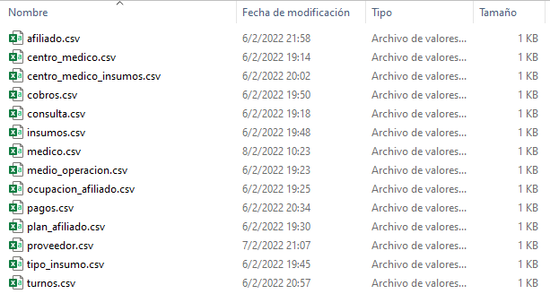
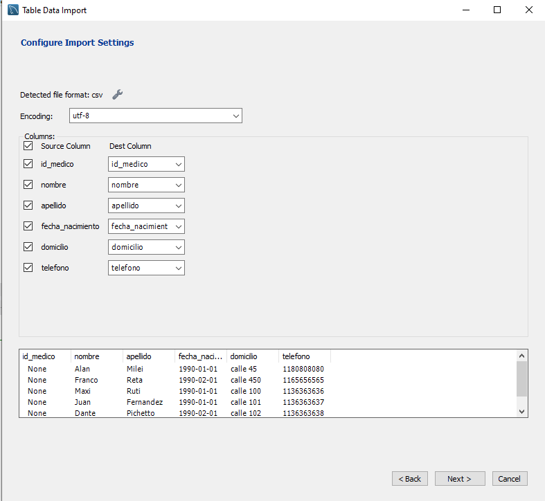
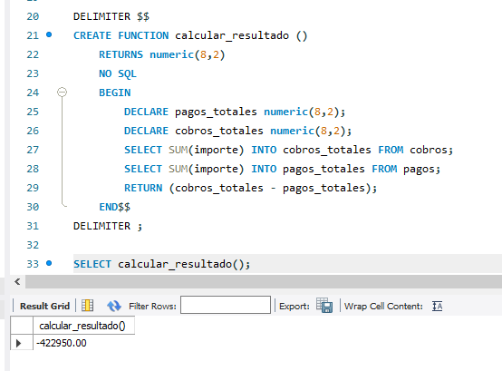
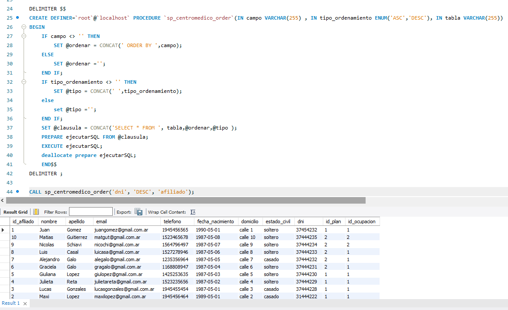
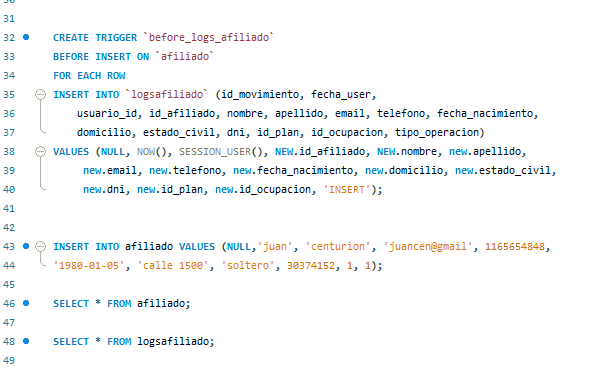
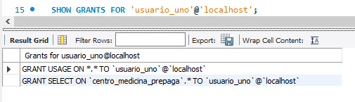

<br>
</br>


```{css my-header-colors, echo = FALSE}
.page-header {
    background-image: linear-gradient(200deg, black, blue);
    border: solid 1px black;
    border-radius: .3rem;
}


```


<style type="text/css">


.toc .toc-box {
    padding: 1.5rem;
    background-color: #f5f5f5;
    border: solid 1px #6b6b6b;
    border-radius: .3rem;
}

a {
    color: black;
    text-decoration: none;
    font-weight: bold;
}


.main-content h2, .main-content h3, .main-content h4, .main-content h5, .main-content h6 {
    margin-top: 2rem;
    margin-bottom: 1rem;
    font-weight: 400;
    color: black;
}


.main-content h1 {
    margin-top: 2rem;
    margin-bottom: 1rem;
    font-weight: 750;
    background-image: linear-gradient(200deg, black, blue);
    color: white;
    text-align: center;
    border: solid 1px black;
    border-radius: .3rem;
    background-color: #f5f5f5;
} 


.main-content table th {
    font-weight: 700;
    background-image: linear-gradient(2000deg, black, blue);
    color: white;
}

.main-content table td{
    padding: .5rem 1rem;
    border-bottom: 1px solid #e9ebec;
    text-align: left;
    color: black;
}

.main-content table tr:nth-child(odd) {
    background-color: #fcfcfc;
}

.main-content table tr:nth-child(even) {
    background-color: #ffffff;
}


h1.title {
  font-size: 58px;
  color: white;
  text-align: center;
}
h3.subtitle { 
    font-size: 24px;
  font-family: "Times New Roman", Times, serif;
  color: white ;
  text-align: center;
}
h4.author { 
    font-size: 20px;
  font-family: "Times New Roman", Times, serif;
  color:white ;
  text-align: center;
}


</style>

<br>
</br>


```{r setup, include=FALSE}
knitr::opts_chunk$set(echo = TRUE)
library(tinytex)


# app.diagrams.net

```


<div style="text-align: left" class="toc-box">
# 1 - Introduccion
</div>


<div style="text-align: right" class="toc-box">
 <a href="#top">Volver al Inicio</a>
</div>


<b>

<div style="text-align: center">
### Bases de Datos SQL
</div>

Las Bases de datos SQL, son bases de datos del tipo Relacionales y estructuradas. Su nombre SQL proviene del término (Structured Query Language), en español: Lenguaje de Consulta Estructurado. Se operan a través de SQL, (“sícuel”), un lenguaje derivado del estándar ANSI SQL.
El lenguaje con el cual se manipulan se conoce como Transact SQL aunque algunas alternativas comerciales utilizan su propia variante con mínimas diferencias sobre el lenguaje estandarizado ANSI SQL.

<br>
</br>


<div style="text-align: center">
### Bases de Datos No-SQL
</div>

Las bases de datos No-SQL (not only SQL) difieren del modelo estructurado, apoyándose en un sistema de almacenamiento del tipo {clave - valor}. No utilizan el lenguaje SQL para realizar operaciones sobre la información almacenada.
Su estructura se basa en el formato de transporte de datos JSON y, además de la categoría clave-valor, el almacenamiento de información se asemeja a bb.dd. documentales, y a las bb.dd. orientadas a grafos.
Mongo DB, Cassandra, Cosmos DB y Firestore, son las más conocidas y utilizadas actualmente.

<br>
</br>


<div style="text-align: center">
### Data Warehouse
</div>

Un <span style = "color:blue">Data Warehouse</span> es un almacén electrónico donde generalmente una empresa u organización mantiene una gran cantidad de información. Los datos de un data warehouse deben almacenarse de forma segura, fiable, fácil de recuperar y fácil de administrar.

```{r, echo=FALSE, out.width="60%", fig.align='center'}
knitr::include_graphics("Imagenes/datawarehouse.jpg")
```


El concepto de data warehouse se originó en 1988 con el trabajo de los investigadores de IBM, Barry Devlin y Paul Murphy aunque el término data warehouse fue acuñado por William H. Inmon, el cual es conocido como el padre de Data Warehousing. Inmon describió un data warehouse como una colección de datos orientada a un tema específico, integrado, variante en el tiempo y no volátil, que soporta el proceso de toma de decisiones.


</b>

<br>
</br>

<div style="text-align: left" class="toc-box">
# 2 - My Sql
</div>


<div style="text-align: right" class="toc-box">
 <a href="#top">Volver al Inicio</a>
</div>

<br>
</br>

```{r, echo=FALSE, out.width="60%", fig.align='center'}
knitr::include_graphics("Imagenes/MySQL-logo.png")
```


<br>
</br>


<b>

Es un sistema de gestión de bases de datos relacional desarrollado bajo licencia dual: Licencia pública general/Licencia comercial por Oracle Corporation y está considerada como la base de datos de código abierto más popular del mundo, y una de las más populares en general junto a Oracle y Microsoft SQL Server, todo para entornos de desarrollo web.

A continuacion se encuentra un link con los instructivos para poder descargar e instalar My Sql:


[Guia de Instalacion de My Sql](https://docs.google.com/document/d/1GrStEE5YxDCRqYwWI0LASCCqiel2qooD/edit?usp=sharing&ouid=107665703043742500688&rtpof=true&sd=true)


[Glosario My Sql](https://docs.google.com/document/d/1Iij_crZc1vvfgk21Dm08D-GgV2Zc3Q4r/edit?usp=sharing&ouid=107665703043742500688&rtpof=true&sd=true)

<br>
</br>


<div style="text-align: center">
### Introduccion a Bases de Datos Relacionales
</div>


Las bases de datos relacionales se basan en el Modelo Relacional usando N cantidad de tablas para representar, tanto los datos, como las relaciones entre estos.
Es poco frecuente encontrar casos de una bb.dd. con una sola tabla pero, en el caso de que se dé esta situación, se le denomina como Base de datos Plana.
El modelo relacional, en el cual se apoyan estas bases de datos, almacenan la información en un conjunto de tablas, y a su vez, las aprovechan para representar tanto los datos como también las relaciones entre cada una de estas.


<br>
</br>

<div style="text-align: left" class="toc-box">
# 3 - Descripcion del proyecto
</div>


<div style="text-align: right" class="toc-box">
 <a href="#top">Volver al Inicio</a>
</div>

<br>
</br>

 **_Temática para el trabajo final:_**
</b>


<b>
Base de datos de una _Empresa de Medicina Prepaga_ donde se va a hacer foco en un modelo de esquema [copo de nieve](https://es.wikipedia.org/wiki/Esquema_en_copo_de_nieve).

La empresa de medicina prepaga tiene varios centros donde cada uno de ellos tiene una especialidad particular. La estructura de la base de datos nos ayuda a almacenar los datos de forma eficiente y de ellos podemos obtener la siguiente información:

<ul>

<li>
Cobros de afiliados y pagos a proveedores por centro medico.
</li>

<li>
Diagnósticos y consultas de los afiliados por centro y medico atendido.
</li>

<li>
Fechas de las consultas y los turnos.
</li>

<li>
Insumos por proveedor, por tipo y por centro medico.
</li>

<li>
Datos de nuestros médicos y afiliados.
</li>

<li>
Distintos medios por los cuales se llevan a cabo las operaciones de cobros y pagos.
</li>

<li>
Resultados netos de caja por periodo y por centro medico.
</li>


</ul>


El objetivo es introducirnos en el mundo de las bases de datos relacionales, entender las distintas funcionalidades que nos proveen para el armado de una base de datos y otras sentencias que nos ayuden al armado final de la base de datos de una empresa de medicina prepaga.


</b>


```{r, echo=FALSE, out.width="90%", fig.align='center'}
knitr::include_graphics("Imagenes/snowflake.png")
```


<br>
</br>

<div style="text-align: left" class="toc-box">
# 4 - Descripción de las tablas
</div>


<div style="text-align: right" class="toc-box">
 <a href="#top">Volver al Inicio</a>
</div>

<br>
</br>

<b>

<div style="text-align: center">
### Tablas
</div>

Cuando nos referimos a una tabla, estamos hablando específicamente de un tipo de elemento, que cumple el paradigma de Modelado de datos, y permite guardar la información denominada registros. Cada tabla se compone de Campos y Columnas. Cada campo debe ser único además de tener un tipo de dato asociado. Cada Columna de una tabla, define el total de la información que se almacena, comúnmente llamada registro.
Un registro es el dato alojado en forma de fila, dentro de una tabla. Otro nombre que se le aplica comúnmente a los registros, es tupla.
Las tablas también suelen ser llamadas, mucho más formalmente: entidad. Y, en algunos textos algo más antiguos: relación. Y al igual que el nombre tupla, aplicado a los registros, los campos o columnas también son denominados más formalmente como: atributos.

<br>
</br>


<div style="text-align: center">
### Estructura de Tablas
</div>

Es una estructura de tablas, las cuales a su vez se relacionan con otras tablas. Su principal característica es no poseer información repetida de forma innecesaria, lo que permite adicionar más información sin llegar a afectar la otra almacenada.

<br>
</br>


<div style="text-align: center">
### Ventajas del modelo Relacional
</div>

* Favorece el proceso de normalización, el cual permite eliminar la redundancia de los datos.

* Permite realizar consultas y obtener reportes de forma ágil y rápida por medio de SQL u otro lenguaje de base de datos estructurado.

* Se pueden crear una o varias relaciones entre todas las tablas.

* Ayuda a evitar la duplicidad de registros guardados.

* Atomiza la información de la mejor forma posible.

* Garantiza la integridad referencial.

* Si un registro se relaciona con otro registro de otra tabla, no permite que el mismo sea eliminado. Asimismo, si se quiere borrar, también pasará con todos los datos relacionados.


<br>
</br>


<div style="text-align: center">
### Tipos de Relaciones
</div>

```{r, echo=FALSE, out.width="80%", fig.align='center'}

```


```{r, echo=FALSE, out.width="80%", fig.align='center'}

```


```{r, echo=FALSE, out.width="80%", fig.align='center'}

```

<div style="text-align: center">
### Logicas
</div>
* Clave primaria <span style = "color:green">PK</span>: también llamada llave primaria o primary key, hace que el registro sea unívoco y obligatoriamente no nulo.

* Clave foránea <span style = "color:blue">FK</span>: también llamada foreign key, clave secundaria o clave externa, puede ser -o no- una clave primaria dentro de la tabla. Su característica es que es el punto de enlace con otra tabla donde ésta es primary key.

* Clave índice: es un campo que facilita la búsqueda dentro de una tabla. Generalmente son campos primary key.

<br>
</br>


<div style="text-align: center">
### Tablas, descripción y atributos
</div>


A continuación se detallaran cada una de las tablas que componen el DER con sus atributos y descripciones:

<br>
</br>

 $$ \textbf{Tabla: Afiliado }$$ 

 **Atributos** |  **Descripcion**    
-----------| ------------|
*id_afiliado*|<b><span style = "color:green">INT NOT NULL PRIMARY KEY AUTOINCREMENT</span></b>
*nombre*|VARCHAR(50) NOT NULL
*apellido*|VARCHAR(50) NOT NULL
*email*|VARCHAR(50) NOT NULL
*telefono*|INT NOT NULL 
*fecha_nacimiento*|DATE NOT NULL
*domicilio*|VARCHAR(50) NOT NULL 
*estado_civil*|VARCHAR(50) NOT NULL 
*dni*|INT NOT NULL 
*id_ocupacion*|<b><span style = "color:blue">INT NOT NULL FOREIGN KEY </span></b>
*id_plan*|<b><span style = "color:blue">INT NOT NULL FOREIGN KEY </span></b>

<br>
</br>


_Esta tabla contiene los atributos de los afiliados de la empresa de medicina prepaga, podemos observar el ID como Primary Key y por ultimo dos FK que hacen referencia a la ocupación del empleado y el plan. Estas serán dos tablas que se crean a parte para no repertir datos._


_Un ejemplo sencillo: La ocupación puede ser empleado bajo relación de dependencia, monotributista, desempleado o jubilado. Estos datos se pondrán aparte en una tabla llamada *ocupacion_afiliado* y en la tabla *afiliado* solo de pondrá el numero de ID ya que al ir dando de alta a los afiliados en el sistema nos ahorrariamos espacio en la base de datos al no tener que repetir tantos caracteres por fila y solamente completar con el ID de ocupacion que viene de la tabla *ocupacion_afiliado*._


<br>
</br>


 $$ \textbf{Tabla: Ocupacion Afiliado }$$ 

 **Atributos** |  **Descripción**    
-----------| ------------|
*id_ocupacion*|<b><span style = "color:green">INT NOT NULL PRIMARY KEY AUTOINCREMENT</span></b>
*ocupación*|VARCHAR(50) NOT NULL

<br>
</br>


_Esta tabla contiene los siguientes datos: *Bajo relacion de dependencia, monotributista, desempleado y jubilado*._

<br>
</br>


 $$ \textbf{Tabla: Plan Afiliado  }$$ 

 **Atributos** |  **Descripción**    
-----------| ------------|
*id_plan*|<b><span style = "color:green">INT NOT NULL PRIMARY KEY AUTOINCREMENT</span></b>
*nombre*|VARCHAR(50) NOT NULL

<br>
</br>


_Esta tabla contiene los siguientes datos: *Medium y Premium*._

<br>
</br>


 $$ \textbf{Tabla: Medico }$$ 

 **Atributos** |  **Descripcion**    
-----------| ------------|
*id_medico*|<b><span style = "color:green">INT NOT NULL PRIMARY KEY AUTOINCREMENT</span></b>
*nombre*|VARCHAR(50) NOT NULL
*apellido*|VARCHAR(50) NOT NULL
*fecha_nacimiento*|DATE NOT NULL
*domicilio*|VARCHAR(50) NOT NULL
*telefono*|INT NOT NULL 

<br>
</br>


_Esta tabla contiene los datos de los médicos que prestan su servicio a distintos centros médicos._


<br>
</br>


 $$ \textbf{Tabla: Centro Medico }$$ 

 **Atributos** |  **Descripcion**    
-----------| ------------|
*id_centro*|<b><span style = "color:green">INT NOT NULL PRIMARY KEY AUTOINCREMENT</span></b>
*nombre*|VARCHAR(50) NOT NULL
*direccion*|VARCHAR(50) NOT NULL
*telefono*|INT NOT NULL 
*codigo_postal*|INT NOT NULL 
*email*|VARCHAR(50) NOT NULL
*fecha_nacimiento*|DATE NOT NULL
*especialidad*|VARCHAR(50) NOT NULL


<br>
</br>


 $$ \textbf{Tabla: Consulta }$$ 

 **Atributos** |  **Descripcion**    
-----------| ------------|
*id_consulta*|<b><span style = "color:green">INT NOT NULL PRIMARY KEY AUTOINCREMENT</span></b>
*consulta*|VARCHAR(50) NOT NULL
*diagnostico*|VARCHAR(50) NOT NULL

<br>
</br>


_Esta tabla contiene los datos de las consultas de los afiliados y los diagnosticos posterior a la consulta._

<br>
</br>


 $$ \textbf{Tabla: Turnos }$$ 

 **Atributos** |  **Descripcion**    
-----------| ------------|
*id_turno*|<b><span style = "color:green">INT NOT NULL PRIMARY KEY AUTOINCREMENT</span></b>
*fecha*|DATE NOT NULL
*id_medico*|<b><span style = "color:blue">INT NOT NULL FOREIGN KEY </span></b>
*id_afiliado*|<b><span style = "color:blue">INT NOT NULL FOREIGN KEY </span></b>
*id_consulta*|<b><span style = "color:blue">INT NOT NULL FOREIGN KEY </span></b>
*id_centro*|<b><span style = "color:blue">INT NOT NULL FOREIGN KEY </span></b>


<br>
</br>


_Esta tabla contiene los datos del turno. Se conecta con varias tablas, entre ellas la de consulta. Una vez registrado el turno en la base de datos y luego de la consulta se completan los valores en la tabla consulta con el diagnostico final._


<br>
</br>


 $$ \textbf{Tabla: Proveedor }$$ 

 **Atributos** |  **Descripcion**    
-----------| ------------|
*id_proveedor*|<b><span style = "color:green">INT NOT NULL PRIMARY KEY AUTOINCREMENT</span></b>
*nombre*|VARCHAR(50) NOT NULL 
*telefono*|INT NOT NULL 
*cuit*|INT NOT NULL 
*mail*|VARCHAR(50) NOT NULL 

<br>
</br>

_La tabla contiene todos los datos de los proveedores que se van dando de alta. No tiene muchos movimientos en general._

<br>
</br>

 $$ \textbf{Tabla: Tipo Insumo }$$ 

 **Atributos** |  **Descripcion**    
-----------| ------------|
*id_tipo_insumo*|<b><span style = "color:green">INT NOT NULL PRIMARY KEY AUTOINCREMENT</span></b>
*tipo_insumo*|VARCHAR(50) NOT NULL 

<br>
</br>


_Tabla que contiene datos sobre el tipo de insumo que compran los centros medicos. No tiene muchos movimientos._

<br>
</br>


 $$ \textbf{Tabla: Insumos }$$ 

 **Atributos** |  **Descripcion**    
-----------| ------------|
*id_insumo*|<b><span style = "color:green">INT NOT NULL PRIMARY KEY AUTOINCREMENT</span></b>
*nombre*|VARCHAR(50) NOT NULL 
*id_centro*|<b><span style = "color:blue">INT NOT NULL FOREIGN KEY </span></b>
*id_tipo_insumo*|<b><span style = "color:blue">INT NOT NULL FOREIGN KEY </span></b>
*id_proveedor*|<b><span style = "color:blue">INT NOT NULL FOREIGN KEY </span></b>

<br>
</br>


_Esta tabla contiene los datos de cada uno de los insumos._

<br>
</br>


 $$ \textbf{Tabla: Centro Medico Insumos }$$ 

 **Atributos** |  **Descripcion**    
-----------| ------------|
*id_centro_medico_insumos*|<b><span style = "color:green">INT NOT NULL PRIMARY KEY AUTOINCREMENT</span></b>
*nombre*|VARCHAR(50) NOT NULL 
*id_centro*|<b><span style = "color:blue">INT NOT NULL FOREIGN KEY </span></b>
*id_insumo*|<b><span style = "color:blue">INT NOT NULL FOREIGN KEY </span></b>

<br>
</br>


_Tabla que conecta de muchos a muchos los insumos con los centros medicos._

<br>
</br>


 $$ \textbf{Tabla: Pagos }$$ 

 **Atributos** |  **Descripcion**    
-----------| ------------|
*id_pagos*|<b><span style = "color:green">INT NOT NULL PRIMARY KEY AUTOINCREMENT</span></b>
*fecha_transaccion*|DATE NOT NULL 
*importe*|INT NOT NULL 
*id_medio_operacion*|<b><span style = "color:blue">INT NOT NULL FOREIGN KEY </span></b>
*id_proveedor*|<b><span style = "color:blue">INT NOT NULL FOREIGN KEY </span></b>
*id_centro*|<b><span style = "color:blue">INT NOT NULL FOREIGN KEY </span></b>
<br>
</br>

_Tabla que registra todos los pagos de todos los centros médicos. Se puede consultar el total de pagos por cada centro medico._

<br>
</br>


 $$ \textbf{Tabla: Cobros }$$ 

 **Atributos** |  **Descripcion**    
-----------| ------------|
*id_cobros*|<b><span style = "color:green">INT NOT NULL PRIMARY KEY AUTOINCREMENT</span></b>
*fecha_transaccion*|DATE NOT NULL 
*importe*|INT NOT NULL 
*id_medio_operacion*|<b><span style = "color:blue">INT NOT NULL FOREIGN KEY </span></b>
*id_afiliado*|<b><span style = "color:blue">INT NOT NULL FOREIGN KEY </span></b>
*id_centro*|<b><span style = "color:blue">INT NOT NULL FOREIGN KEY </span></b>

<br>
</br>


_Tabla que registra todos los cobros de todos los centros médicos. El id_centro que aparece en la linea del cobro de la empresa de medicina prepaga no se relaciona necesariamente con que le haya hecho un pago a ese centro medico, sino que hace relación a que con mayor frecuencia se atiende en ese centro y se termina imputando el cobro de esa manera._

<br>
</br>


 $$ \textbf{Tabla: Medio Operacion }$$ 

 **Atributos** |  **Descripcion**    
-----------| ------------|
*id_medio_operacion*|<b><span style = "color:green">INT NOT NULL PRIMARY KEY AUTOINCREMENT</span></b>
*tipo_medio_operacion*|VARCHAR(50) NOT NULL 

<br>
</br>


_Tabla que registra todos medios financieros de pagos: *Tarjeta de Debito, Crédito, Efectivo y Transferencias*._

</b>
<br>
</br>


<div style="text-align: left" class="toc-box">
# 5 - Diagrama Entidad de Relacion
</div>


<div style="text-align: right" class="toc-box">
 <a href="#top">Volver al Inicio</a>
</div>


<br>
</br>

<b>
Un diagrama entidad-relación, también conocido como modelo entidad relación o ERD, es un tipo de diagrama de flujo que ilustra cómo las "entidades", como personas, objetos o conceptos, se relacionan entre sí dentro de un sistema. Los diagramas ER se usan a menudo para diseñar o depurar bases de datos relacionales en los campos de ingeniería de software, sistemas de información empresarial, educación e investigación.

En <b>[este link](https://app.diagrams.net/)</b> se puede elaborar un DER preliminar para luego trabajarlo en una base de datos.


```{css , echo = FALSE}

.myimg {
  border: solid 1px black;
}


```

<br>
</br>


```{r, echo=FALSE, out.width="100%", fig.align='center' ,out.extra='class="myimg"'}
knitr::include_graphics("DER.png")
```


<br>
</br>

Luego de crear las tablas en My Sql podemos ver el Reverse Engineer. 

La ingeniería inversa o retroingeniería es el proceso llevado a cabo con el objetivo de obtener información o un diseño a partir de un producto, con el fin de determinar cuáles son sus componentes y de qué manera interactúan entre sí y cuál fue el proceso de fabricación. 


<br>
</br>

```{r, echo=FALSE, out.width="50%", fig.align='center' ,out.extra='class="myimg"'}

```

<br>
</br>


La siguiente imagen representa el Reverse Engineer de la base de datos creada:

</b>

<br>
</br>

```{r, echo=FALSE, out.width="100%", fig.align='center' ,out.extra='class="myimg"'}
knitr::include_graphics("REVERSE.png")
```


<br>
</br>


<div style="text-align: left" class="toc-box">
# 6 - Inserción de datos
</div>

<div style="text-align: right" class="toc-box">
 <a href="#top">Volver al Inicio</a>
</div>


<br>
</br>


**_Metodologia utilizada:_**
<b>
Los valores en cada una de las tablas se insertaron desde archivos .csv.

Los archivos son los siguientes:

<br>
</br>

```{r, echo=FALSE, out.width="80%", fig.align='center' ,out.extra='class="myimg"'}

```


<br>
</br>

  
  
  
_Cada una de las tablas contiene 10 observaciones_


_Ejemplo tabla afiliados:_

<br>
</br>

```{r, echo=FALSE, out.width="100%", fig.align='center' ,out.extra='class="myimg"'}

```


<br>
</br>


A continuación se adjuntan scripts de los pasos para importar los datos y MySql final:

<br>
</br>

```{r, echo=FALSE, out.width="80%", fig.align='center' ,out.extra='class="myimg"'}

```


<br>
</br>

```{r, echo=FALSE, out.width="80%", fig.align='center' ,out.extra='class="myimg"'}

```

<br>
</br>


```{r, echo=FALSE, out.width="80%", fig.align='center' ,out.extra='class="myimg"'}

```

<br>
</br>

<div style="text-align: left" class="toc-box">
# 7 - Incersion de Datos desde Python
</div>

<div style="text-align: right" class="toc-box">
 <a href="#top">Volver al Inicio</a>
</div>


<br>
</br>


<b>

A continuacion se adjunta un breve .gif que muestra la ingesta de datos a My Sql desde Python. Se utiliza un While que finaliza cuando el usuario desea dejar de ingresar datos. Los datos se ingresan en la tabla de afiliados dandolos de alta en el sistema.

</b>

<br>
</br>

{width=100%}


<br>
</br>


<div style="text-align: left" class="toc-box">
# 8 - Inner Join
</div>

<div style="text-align: right" class="toc-box">
 <a href="#top">Volver al Inicio</a>
</div>


<br>
</br>

<b>

Inner Join es una sentencia de SQL para recuperar datos de varias tablas al mismo tiempo. En la siguiente imagen se muestra una consulta de todos los afiliados de la base de datos con los pagos de las cuotas acumuladas en el año.

Se tienen en cuenta las siguientes sentencias:

* Inner Join entre todas las tablas.

* Sumatoria total de la variable importe de la tabla cobros.

* Se extrae el año de la variable fecha_transaccion.

* Se agrupa por afiliado único.

* Se ordena de mayor a menor los importes de pago acumulados.

<br>
</br>

```{r, echo=FALSE, out.width="80%", fig.align='center' ,out.extra='class="myimg"'}

```

<br>
</br>

El siguiente join es entre la tabla pagos y proveedores, se agrupa cada uno de los proveedores con el importe total sumado de los pagos hechos a cada uno de ellos:

```{r, echo=FALSE, out.width="80%", fig.align='center' ,out.extra='class="myimg"'}

```

<br>
</br>

A continuación se trabajara con el software R para crear un grafico de torta por proveedor con los montos totales de pago a cada uno de ellos:

<br>
</br>

```{r, echo=FALSE, warning=FALSE, message=FALSE}

library(highcharter)
library(tidyverse)
library(readxl)
library(dplyr)

df_2 = read_excel('C:/Users/maxig/Desktop/Carpetas/Cursos/SQL Coder/Trabajo Final/Codigo Python/df_2.xlsx')


colnames(df_2) = c('Proveedor','Fecha de Pago', 'Pago Total')

library(reticulate)

```

<br>
</br>


```{r, echo=TRUE, fig.cap= 'Pie Chart'}

pie_chart = df_2 %>% 
  hchart('pie', hcaes(x = df_2$Proveedor, y = df_2$`Pago Total`, color = viridis::mako(n = length(df_2$Proveedor)))) %>% 
  hc_add_theme(hc_theme_google()) %>% 
  hc_tooltip(pointFormat = '<b>Pago Total</b>  {point.y}') %>% 
  hc_title(text = 'Pie Chart Pagos por Proveedor en ARS',
           style = list(fontSize = '20px', fontWeight = 'bold')) %>% 
  hc_subtitle(text = '<b>From MySql</b>',
              style = list(fontSize = '16px', color = "black")) %>% 
  hc_credits(enabled = TRUE, text = '@MGaloto',
             style = list(fontSize = '16px', color = "black")) 

pie_chart

```

<br>
</br>


</b>

<div style="text-align: left" class="toc-box">
# 9 - Vistas
</div>


<div style="text-align: right" class="toc-box">
 <a href="#top">Volver al Inicio</a>
</div>


<br>
</br>


<b>


Una Vista SQL es básicamente una tabla virtual que se genera a partir de la ejecución de una o más consultas SQL, aplicada sobre una o más tablas. Su estructura corresponde a una serie de filas y columnas tal como encontramos en las tablas SQL, que almacenan la vista de la información tal como la definimos al crearla.
Podemos guardar las Vistas con un nombre distintivo, para poder ejecutarlas cuantas veces consideremos necesario.
Su almacenamiento se da en la sección Views de los objetos de la base de datos.

<br>
</br>

<div style="text-align: center">
### Beneficios
</div>
* Privacidad de la información: los usuarios podrán ver solo aquellos datos que creamos convenientes mostrar.

* Rendimiento de la bb.dd.: Crear queries sobre vistas complejas nos ahorra ejecutar una query pesada para llegar a la información.

* Protección de datos: Aquellos usuarios que no poseen un entorno de pre-producción, las vistas evitan errores de borrado o alteración.


<br>
</br>

<div style="text-align: center">
### Scripts de Vistas
</div>

**_A continuación se adjuntan los scripts de las vistas_**

_El código SQL de las vistas se encuentra en el siguiente link:_ [Github Codigo](https://github.com/MGaloto/mysql_creando_database/blob/main/database.py)


<ul>

<br>
</br>

**_1) Vista 1:_**


_Consulta y Diagnostico por Afiliado_

_Esta vista permite guardarnos en una tabla aparte todos los turnos solicitados por los afiliados dados de alta en el sistema. Nos sirve para estar actualizados de los ultimos turnos ya que esta ordenada por fecha._

<br>
</br>

```{r, echo=FALSE, out.width="50%", fig.align='center' ,out.extra='class="myimg"'}

```


<br>
</br>


**_2) Vista 2_**

_Que medico atendió a cada paciente:_

_Esta vista creada nos sirve para visualizar forma rapida mediante su consulta sobre que medicos atendieron a que paciente en determinada fecha._

<br>
</br>


```{r, echo=FALSE, out.width="50%", fig.align='center' ,out.extra='class="myimg"'}

```


<br>
</br>


**_3) Vista 3_**

_Que medico atiende en cada centro medico:_

_Esta vista permite que podamos visualizar de forma rapida que medicos atienden en los centros medicos._

<br>
</br>

```{r, echo=FALSE, out.width="50%", fig.align='center' ,out.extra='class="myimg"'}

```


<br>
</br>


</ul>


</b>

<div style="text-align: left" class="toc-box">
# 10 - Funciones
</div>


<div style="text-align: right" class="toc-box">
 <a href="#top">Volver al Inicio</a>
</div>


<br>
</br>


<b>

Por definición es importante indicar que una función es un conjunto de instrucciones SQL que realizan una tarea específica de manera automática. Una función acepta entradas en forma de parámetros y devuelve un valor.

Las funciones personalizadas o almacenadas de Mysql permiten procesar y manipular datos de forma procedural y eficiente. Dichos datos son enviados a través de uno o más parámetros, al momento de invocar la función, y devueltos como resultado por esta misma.

Podemos crear funciones, a la medida de nuestra necesidad, combinando a las mismas con funciones ya existentes del lenguaje Mysql, para así obtener los resultados deseados tal como necesitamos.

Algunos de los beneficios a destacar:

* Mejoran la integridad y seguridad de los datos

* Optimizan el rendimiento de la base de datos

* Otorgan una mejor lectura del código


**_A continuación se adjuntan los scripts de las funcioness_**


<ul>

**_1) Función 1:_**


_Función donde ingresamos un CHAR y nos devuelve un NUMERIC_

_Ingresamos el diagnostico y nos regresa el porcentaje de pacientes con el diagnostico ingresado de nuestra base de datos_

_En la parte inferior de la imagen adjunta se puede ver el resultado de la función una vez ingresado un CHAR._

<br>
</br>


```{r, echo=FALSE, out.width="80%", fig.align='center' ,out.extra='class="myimg"'}

```


<br>
</br>


**_2) Función 2:_**


_Función que no requiere un valor de entrada._

_Esta funcion nos calcula automaticamente la diferencia entre ingresos y egresos de todos los centros medicos._

_En la parte inferior de la imagen adjunta se puede ver el resultado de la función una vez ingresado un CHAR._

<br>
</br>

```{r, echo=FALSE, out.width="80%", fig.align='center' ,out.extra='class="myimg"'}

```

<br>
</br>


</ul>

</b>

<div style="text-align: left" class="toc-box">
# 11 - Stored Procedures
</div>


<div style="text-align: right" class="toc-box">
 <a href="#top">Volver al Inicio</a>
</div>


<br>
</br>


<b>
Un Stored Procedure o Procedimiento Almacenado es un programa almacenado físicamente en una base de datos, creado para cumplir tareas específicas. Permite también establecer niveles de seguridad y manipular operaciones complejas o extensas del lado del servidor, evitando un ida y vuelta de datos que termine sobrecargando una red o servidor.

Su estructura es similar a las Funciones SQL que vimos la clase anterior pero, a diferencia de éstas, un Stored Procedure esta pensado para resolver desde una operación simple, hasta operaciones complejas que requieran modificar varias tablas y/o datos almacenados en una base de datos.

Algunos Beneficios:

* El motor de bb.dd. controla las operaciones.
* Se ejecuta en un servidor independiente.
* Devuelve al usuario el resultado final, evitando sobrecargar su computadora con procesos.
* Evita programar una lógica compleja del lado del usuario.
* Minimiza los errores concentrando las operaciones.


**_A continuación se adjuntan los scripts de los Stored Procedures_**

<ul>


**_1) Stored Procedure 1:_**


_En el siguiente Stored Procedure insertamos valores en la tabla turno con el ID creado anteriormente en la tabla consulta._

<br>
</br>

```{r, echo=FALSE, out.width="80%", fig.align='center' ,out.extra='class="myimg"'}

```

<br>
</br>


**_2) Stored Procedure 2:_**


_El siguiente Stored Procedure ejecuta un comando que nos permite ordenar la tabla que queramos por una variable._

<br>
</br>

```{r, echo=FALSE, out.width="80%", fig.align='center' ,out.extra='class="myimg"'}

```

<br>
</br>


</ul>
</b>


<div style="text-align: left" class="toc-box">
# 12 - Triggers
</div>


<div style="text-align: right" class="toc-box">
 <a href="#top">Volver al Inicio</a>
</div>

<br>
</br>


<b>

Un disparador o trigger es una funcionalidad que la base de datos ejecuta de forma automática cuando se realiza una operación de tipo Insert, Update o Delete en una tabla o vista, o cuando se ejecuta una consulta SQL sobre una tabla o vista.

Un trigger no puede existir sin una tabla asignada, podemos crear muchos triggers para una tabla. 

Cuando un evento ya sea de tipo Insert, Update o Delete se realiza en una tabla que contiene uno o varios triggers, en la tabla que creamos que comienza con logs se ejecuta tambien ese evento modificando la tabla. Hay dos comandos que podemos utilizar, el Before y el After, con el primero cuando insertamos datos en la tabla principal primero ingresaran al triger y luego a la tabla principal, con el After ocurre todo lo contrario.

**_A continuación se adjuntan los scripts de los Triggers_**


<ul>

**_1) Triggers 1:_**


_En el siguiente Trigger se crea un log para la tabla afiliados y luego de insertar los datos en la tabla afiliados van a parar al trigger creado._
<br>
</br>


```{r, echo=FALSE, out.width="80%", fig.align='center' ,out.extra='class="myimg"'}

```


<br>
</br>

_Lo contrario sucede con la próxima imagen que es un Before._
<br>
</br>

```{r, echo=FALSE, out.width="80%", fig.align='center' ,out.extra='class="myimg"'}

```


<br>
</br>


**_2) Triggers 2:_**


_En el siguiente Trigger se crea un log para la tabla consulta y antes de que se completen los nuevos valores para la tabla se completan en la tabla de logs con fecha, usuario, id y tipo de operación._

_Lo contrario sucede con la próxima imagen que es un Before._

<br>
</br>

```{r, echo=FALSE, out.width="80%", fig.align='center' ,out.extra='class="myimg"'}

```


<br>
</br>


_Lo contrario sucede con la próxima imagen que es un Before._
<br>
</br>

```{r, echo=FALSE, out.width="80%", fig.align='center' ,out.extra='class="myimg"'}

```


<br>
</br>


</ul>

</b>


<div style="text-align: left" class="toc-box">
# 13 - Permisos
</div>


<div style="text-align: right" class="toc-box">
 <a href="#top">Volver al Inicio</a>
</div>

<br>
</br>


<b>

Sentencias GRANT y REVOKE

Utilizando la sentencia GRANT podemos dar permisos al usuario creado para que pueda hacer los siguientes comandos sobre la base de datos o una tabla en particular: SELECT, INSERT, UPDATE y DELETE.

Con la sentencia REVOKE le quitamos permisos al usuario.


**_A continuación se adjuntan los scripts de los Usuarios creados y las sentencias_**

<ul>

_Creamos el usuario_uno y el usuario_dos donde al primero le damos permiso con la sentencia GRANT para que solo pueda hacer comandos SELECT. Al usuario_dos le damos permiso para que pueda alterar, seleccionar e insertar datos._

_Con la sentencia REVOKE le quitamos a ambos usuarios la posibilidad de eliminar registros._
<br>
</br>


```{r, echo=FALSE, out.width="80%", fig.align='center' ,out.extra='class="myimg"'}
knitr::include_graphics("Imagenes/user.png")
```

<br>
</br>


_SHOW GRANTS para el usuario_uno._


_Podemos ver que solo tiene permiso para la sentencia SELECT en la base de datos._
<br>
</br>

```{r, echo=FALSE, out.width="80%", fig.align='center' ,out.extra='class="myimg"'}

```
<br>
</br>


_SHOW GRANTS para el usuario_dos._

_Podemos ver que tiene permiso para la sentencia SELECT, INSERT y ALTER en la base de datos._
<br>
</br>
```{r, echo=FALSE, out.width="80%", fig.align='center' ,out.extra='class="myimg"'}
knitr::include_graphics("Imagenes/user_2.png")
```


</b>

<br>
</br>


<b>

<div style="text-align: left" class="toc-box">
# 14 - Backup
</div>

<div style="text-align: right" class="toc-box">
 <a href="#top">Volver al Inicio</a>
</div>

<br>
</br>


En el mundo digital, algo que nunca puede pasarse por alto es resguardar la información o datos con los cuales trabajamos a diarios.

Más allá de este resguardo de archivos y/o documentos, las bases de datos también son contempladas como una fuente de información importante y por ello deben incluirse en una rutina de copia de seguridad.

Mysql incluye la herramienta mysqldump dentro del motor de base de datos para gestionar las copias de seguridad. 


**_A continuación se realizara un Backup de la base de datos_**


_Para crear el Backup de las tablas dejando de lado la estructura debemos hacer los siguientes pasos:_

<br>
</br>
```{r, echo=FALSE, out.width="50%", fig.align='center' ,out.extra='class="myimg"'}

```


<br>
</br>

_Click en la base de datos:_

<br>
</br>
```{r, echo=FALSE, out.width="80%", fig.align='center' ,out.extra='class="myimg"'}
knitr::include_graphics("Imagenes/backup2.png")
```


<br>
</br>

_Tildar todas las opciones:_
<br>
</br>

```{r, echo=FALSE, out.width="80%", fig.align='center' ,out.extra='class="myimg"'}

```


<br>
</br>

_Seleccionar Export to Self-Contained File:_

_Esta opción nos exportara un archivo .sql_

<br>
</br>
```{r, echo=FALSE, out.width="50%", fig.align='center' ,out.extra='class="myimg"'}

```


<br>
</br>

_Seleccionar Start Export:_
<br>
</br>

```{r, echo=FALSE, out.width="80%", fig.align='center' ,out.extra='class="myimg"'}

```


_Listo con el Backup._

</b>


<b>

<div style="text-align: left" class="toc-box">
# 15 - Business Intelligence
</div>

<div style="text-align: right" class="toc-box">
 <a href="#top">Volver al Inicio</a>
</div>

<br>
</br>


La Inteligencia de Negocios o Business Intelligence (BI) se puede definir como el proceso de analizar datos históricos y acumulados para extraer una cierta inteligencia o conocimiento a partir de ellos, información que resulta de gran utilidad para las prácticas laborales para la elaboración de informes y reportes.


A continuación se adjunta un script que muestra el código a ejecutar en Python para conectarse a la base de datos, crear un Data Frame y manupularlo desde el IDE. En este caso, el Data Frame se crea con datos de una Vista de My Sql, se guarda en una planilla de Excel en la carpeta del trabajo y se explotan los datos utilizando el software R.


<br>
</br>


<div style="text-align: center">
<b>Python Code:</b>
</div>

<br>
</br>


```{python eval=FALSE}


import pymysql
import pandas as pd


def run():
  connection = pymysql.connect(host= 'Poner el Host', 
                               user= 'Poner el User', 
                               password= 'Poner el Pass', 
                               db='Poner la Base de Datos' )
  cursor = connection.cursor()
  query = 'SELECT * FROM vista_consulta_diagnostico'
  cursor.execute(query)
  df = pd.read_sql(query, connection)
  df.to_excel('df.xlsx', index=False)
  

if __name__ == '__main__':
  run()
  


```


<br>
</br>

<div style="text-align: center">
<b>R Code:</b>
</div>

<br>
</br>

```{r, echo=FALSE, warning=FALSE, message=FALSE}


df = read_excel('C:/Users/maxig/Desktop/Carpetas/Cursos/SQL Coder/Trabajo Final/Codigo Python/df.xlsx')


df_final = data.frame(table(df$Diagnostico))


colnames(df_final) = c('Diagnostico','Frecuencia')


```

<br>
</br>

Se utiliza la librería <b>{<span style = "color:green">highcharter</span>}</b> en R.

Para mas información sobre la librería click [aqui](https://cran.r-project.org/web/packages/highcharter/highcharter.pdf)

<br>
</br>


```{r, echo=TRUE, fig.cap= 'Pie Chart'}

pie = df_final %>% 
  hchart('pie', hcaes(x = Diagnostico, y = Frecuencia, color = viridis::mako(n = length(df_final$Diagnostico)))) %>% 
  hc_add_theme(hc_theme_google()) %>% 
  hc_tooltip(pointFormat = '<b>Cantidad Diagnostico</b>  {point.y}') %>% 
  hc_title(text = 'Pie Chart Diagnosticos',
           style = list(fontSize = '20px', fontWeight = 'bold')) %>% 
  hc_subtitle(text = '<b>From MySql</b>',
              style = list(fontSize = '16px', color = "black")) %>% 
  hc_credits(enabled = TRUE, text = '@MGaloto',
             style = list(fontSize = '16px', color = "black")) 

pie

```


<br>
</br>

```{r, echo=TRUE, fig.cap= 'Bar Graph' ,out.extra='class="myimg"'}


bar_plots = df_final %>% 
  arrange(desc(Frecuencia)) %>% 
  hchart('column', hcaes(x = Diagnostico, y = Frecuencia, color = viridis::mako(n = length(df_final$Diagnostico))),
         showInLegend = F,
         maxSize = "15%",
         dataLabels = list(enabled = TRUE,
                           format = '% {point.y: .2f}')) %>% 
  hc_add_theme(hc_theme_google()) %>% 
  hc_tooltip(pointFormat = '<b>Diagnosticos</b> {point.y} <br> ' ) %>% 
  hc_title(text = 'Diagnosticos',
           style = list(fontSize = '20px', fontWeight = 'bold')) %>% 
  hc_subtitle(text = '<b>From MySql</b>',
              style = list(fontSize = '16px', color = "black")) %>% 
  hc_credits(enabled = TRUE, text = '@MGaloto',
             style = list(fontSize = '16px', color = "black")) %>% 
  hc_yAxis(labels = list(style = list(color = "black")),
           tickColor = "black") %>% 
  hc_xAxis(labels = list(style = list(color = "black")),
           tickColor = "black")

bar_plots

```


<br>
</br>


<div style="text-align: left" class="toc-box">
# 16 - Codigo My Sql desde Python
</div>

<div style="text-align: right" class="toc-box">
 <a href="#top">Volver al Inicio</a>
</div>


<br>
</br>


<b>
En los siguientes enlaces se encuentra el código para crear la base de datos desde Python y My Sql:

El repositorio contiene:

<ul>

<br>

<li>
Codigo MySql: Todo el codigo de todos los scripts .sql para crear la base de datos y todos los items del trabajo
</li>

</br>

<br>

<li>
Script Final: Script .sql que ejecuta el trabajo completo.
</li>

</br>


<br>

<li>
Codigo Python: Codigo de Python para crear las tablas e insertar valores en la tabla afiliados utilizando input. Tambien se encuentra la conexcion a My Sql, creacion de un data frame y exportacion a otra carpeta.
</li>

</br>

</ul>


<br>
</br>

```{r, echo=FALSE, out.width="40%", fig.align='center' ,out.extra='class="myimg"'}
knitr::include_graphics("Imagenes/github.jpg")
```

<br>
</br>


<div style="text-align: center" >
[Link Github Codigo .sql](https://github.com/MGaloto/mysql_creando_database/tree/main/Codigo%20MySql)
</div>

<div style="text-align: center" >
[Link Github Codigo Python](https://github.com/MGaloto/mysql_creando_database/tree/main/Codigo%20Python)
</div>


<br>
</br>

<div style="text-align: right" class="toc-box">
 <a href="#top">Volver al Inicio del Trabajo</a>
</div>


